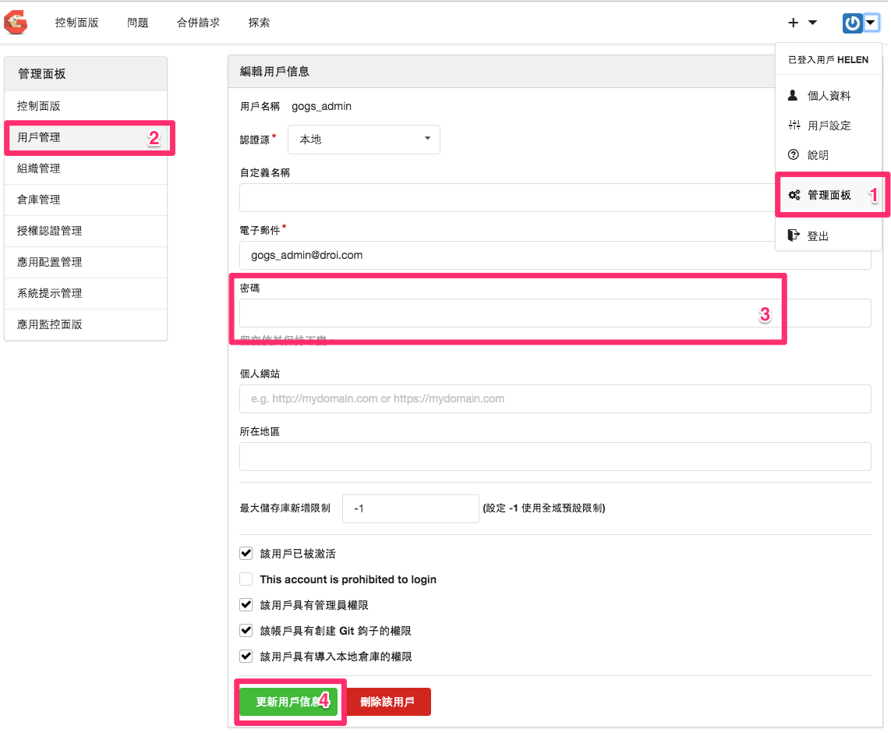

# Gogs service Install Giude 

### Preparation

> * Prerequisites : MySQL or PostgreSQL
> * Machines infotmation: Hostname, IP, repository...
> * app.ini config file 

### Example Information

> - Machine role: gogs git service
> - Machine IP: 10.128.112.2(eth0)
> - Hostname: appgogs
> - servcie version: v0.9.97
> - Github repository: https://github.com/gogits/gogs

### General Step

1. **install prerequisites**  
2. Change to user git and Get service binary from repository  

	```
	sudo su git
	cd
	wget https://github.com/gogits/gogs/releases/download/v0.9.97/linux_amd64.tar.gz
	```

3. Extract the file  
	`tar -xzf linux_amd64.tar.gz`
4. Turn to the gogs directory.  
	`cd gogs`

5. (under root)create directory for repository

	```
	mkdir /opt/gogs-repositories
	chown git:git /opt/gogs-repositories
	```
6. **Config gogs**

7. start gogs server  
	`./gogs web`


### Install Prerequisites 
* add user git

```
sudo adduser --disabled-login --gecos 'Gogs' git
```

* install git

```
sudo apt-get update
sudo apt-get install git  
```
* install postgres

```
sudo apt-get update
sudo apt-get install postgresql
```
```
sudo -u postgres psql -d template1
CREATE USER git CREATEDB;
\password git
CREATE DATABASE gogs_production OWNER git;
\q

sudo -u git -H psql -d gogs_production
gogs_production> \q
```
###Config gogs
there are two ways to configure gogs

* Config using web UI  

	```
	sudo su git
	cd /home/git/gogs
	./gogs web
	```
	
Fill in the infomations (圖片僅供參考)


	

* Config by using the app.ini config file

	```
	sudo su git
	cd /home/git/gogs
	mkdir custom
	mkdir custom/conf
	vim custom/conf/app.ini
	```
	
### Run gogs as a daemon  
  

put the _script_ into your gogs server

Here's the script

```
#! /bin/sh
### BEGIN INIT INFO
# Provides:          gogs
# Required-Start:    $syslog $network $local_fs postgresql
# Required-Stop:     $syslog $local_fs
# Default-Start:     2 3 4 5
# Default-Stop:      0 1 6
# Short-Description: A self-hosted Git service written in Go.
# Description:       A self-hosted Git service written in Go.
### END INIT INFO

# Author: Danny Boisvert

# Do NOT "set -e"

# PATH should only include /usr/* if it runs after the mountnfs.sh script
PATH=/sbin:/usr/sbin:/bin:/usr/bin
DESC="Go Git Service"
NAME=gogs
SERVICEVERBOSE=yes
PIDFILE=/var/run/$NAME.pid
SCRIPTNAME=/etc/init.d/$NAME
WORKINGDIR=/home/git/gogs
DAEMON=$WORKINGDIR/$NAME
DAEMON_ARGS="web"
USER=git

# Read configuration variable file if it is present
[ -r /etc/default/$NAME ] && . /etc/default/$NAME

# Exit if the package is not installed
[ -x "$DAEMON" ] || exit 0

# Load the VERBOSE setting and other rcS variables
. /lib/init/vars.sh

# Define LSB log_* functions.
# Depend on lsb-base (>= 3.2-14) to ensure that this file is present
# and status_of_proc is working.
. /lib/lsb/init-functions

#
# Function that starts the daemon/service
#
do_start()
{
	# Return
	#   0 if daemon has been started
	#   1 if daemon was already running
	#   2 if daemon could not be started
	sh -c "USER=$USER start-stop-daemon --start --quiet --pidfile $PIDFILE --make-pidfile \\
			--test --chdir $WORKINGDIR --chuid $USER \\
			--exec $DAEMON -- $DAEMON_ARGS > /dev/null \\
			|| return 1"
	sh -c "USER=$USER start-stop-daemon --start --quiet --pidfile $PIDFILE --make-pidfile \\
			--background --chdir $WORKINGDIR --chuid $USER \\
			--exec $DAEMON -- $DAEMON_ARGS \\
			|| return 2"
}

#
# Function that stops the daemon/service
#
do_stop()
{
	# Return
	#   0 if daemon has been stopped
	#   1 if daemon was already stopped
	#   2 if daemon could not be stopped
	#   other if a failure occurred
	start-stop-daemon --stop --quiet --retry=TERM/1/KILL/5 --pidfile $PIDFILE --name $NAME
	RETVAL="$?"
	[ "$RETVAL" = 2 ] && return 2
	start-stop-daemon --stop --quiet --oknodo --retry=0/1/KILL/5 --exec $DAEMON
	[ "$?" = 2 ] && return 2
	# Many daemons don't delete their pidfiles when they exit.
	rm -f $PIDFILE
	return "$RETVAL"
}


case "$1" in
  start)
	[ "$SERVICEVERBOSE" != no ] && log_daemon_msg "Starting $DESC" "$NAME"
	do_start
	case "$?" in
		0|1) [ "$SERVICEVERBOSE" != no ] && log_end_msg 0 ;;
		2) [ "$SERVICEVERBOSE" != no ] && log_end_msg 1 ;;
	esac
	;;
  stop)
	[ "$SERVICEVERBOSE" != no ] && log_daemon_msg "Stopping $DESC" "$NAME"
	do_stop
	case "$?" in
		0|1) [ "$SERVICEVERBOSE" != no ] && log_end_msg 0 ;;
		2) [ "$SERVICEVERBOSE" != no ] && log_end_msg 1 ;;
	esac
	;;
  status)
	status_of_proc "$DAEMON" "$NAME" && exit 0 || exit $?
	;;
  restart|force-reload)
	log_daemon_msg "Restarting $DESC" "$NAME"
	do_stop
	case "$?" in
	  0|1)
		do_start
		case "$?" in
			0) log_end_msg 0 ;;
			1) log_end_msg 1 ;; # Old process is still running
			*) log_end_msg 1 ;; # Failed to start
		esac
		;;
	  *)
		# Failed to stop
		log_end_msg 1
		;;
		esac
	;;
  *)
		echo "Usage: $SCRIPTNAME {start|stop|status|restart|force-reload}" >&2
		exit 3
		;;
esac

:
```

```
sudo mv <current_script_location> /etc/init.d/gogs  
sudo chmod ug+x /etc/init.d/gogs  
sudo update-rc.d gogs defaults 30 70  
```
test   

```
sudo service gogs start
sudo service gogs status
```  

### Check point
1. Open web browser and enter `http://10.128.112.2:3000/`. Check that homepage of gogs is reachable
2. Register a new user and login using the username and password
3. create a new repository and commit something. 

### Trouble Shoot

- 如果忘記管理員密碼
	1. 創建一位新的用戶或從現有用戶中選擇
	2. ssh登入gogs主機用戶git
	3. 連接資料庫
	
		```
		psql -Ugit -dgogs_production
		
		//query user helen id
		select * from public.user where name ='helen';
		select id,name from public.user where name ='helen';
		
		// setting user 
		UPDATE public.user SET is_admin=true where id =2;
		
		// check user helen grant admin priveleges
		select id,name,is_admin from public.user where name ='helen';  
		 id | name  | is_admin 
		 ----+-------+----------
 		 2 | helen | t

		```
	4. then you can access admin panel and change user gogs_admin using the user account
	
- 如果網頁排版亂定 or 啟動gogs 的時候出現下面訊息：
	`[I] Listen: http://0.0.0.0:3000/10.128.116.129:3000`
	檢查`/home/git/gogs/custom/conf/app.ini`檔案是否正確
	

### Example

custom/conf/app.ini

```
APP_NAME = Gogs: Go Git Service
RUN_USER = git
RUN_MODE = prod

[database]
DB_TYPE  = postgres
HOST     = 127.0.0.1:5432
NAME     = gogs_production
USER     = git
PASSWD   = password
SSL_MODE = disable
PATH     = data/gogs.db

[repository]
ROOT = /opt/gogs-repositories

[server]
DOMAIN       = 10.128.116.129
HTTP_PORT    = 3000
ROOT_URL     = http:/10.128.116.129:3000/
DISABLE_SSH  = false
SSH_PORT     = 22
OFFLINE_MODE = false

[mailer]
ENABLED = false

[service]
REGISTER_EMAIL_CONFIRM = false
ENABLE_NOTIFY_MAIL     = false
DISABLE_REGISTRATION   = false
ENABLE_CAPTCHA         = true
REQUIRE_SIGNIN_VIEW    = false

[picture]
DISABLE_GRAVATAR        = false
ENABLE_FEDERATED_AVATAR = false

[session]
PROVIDER = file

[log]
MODE      = file

```


### Reference
* [Gogs official docs] (https://gogs.io/docs)
* [Run gogs as service](https://gogs.io/docs/advanced/configuration_for_source_builds#adding-gogs-to-init.d)
* [init.d/gogs script source]((https://github.com/gogits/gogs/blob/master/scripts/init/debian/gogs))
